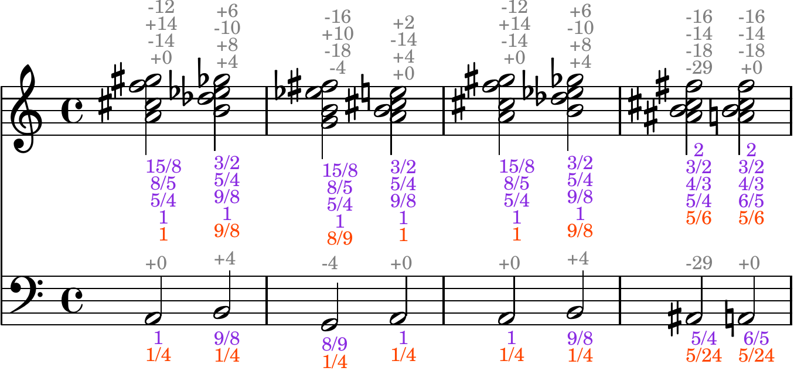

Welcome to Jird's documentation!
========================================

**Jird** is a little language for writing and hearing music in `just
intonation <https://www.kylegann.com/tuning.html>`_. It uses ratios to
express frequencies, durations, and volumes.

**Example source**:

.. literalinclude:: ../../music/music_example

**Output sheet music**:

|

**Output audio**:

.. raw:: html

    <audio controls="controls">
      <source src="_static/music_example.mp3" type="audio/mp3">
      Your browser does not support the <code>audio</code> element.
    </audio>

|

Some music made with jird is on `SoundCloud
<https://soundcloud.com/jird-836630787/sets/jird-music>`_.

Contents
--------

.. toctree::
   :maxdepth: 2

   installation
   quick_start
   tutorials
   music
   resources
   reference

Indices and tables
==================

* :ref:`genindex`
* :ref:`modindex`
* :ref:`search`
