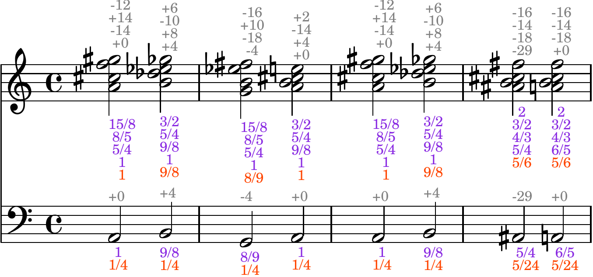

Lilypond
========

Generating sheet music
----------------------
Jird can translate music written as ratios into `lilypond
<https://lilypond.org/>`_ code, a text representation of sheet
music. Lilypond can then turn this into a pdf with nice sheet music in.
For example if we have the following music in a text file `music.txt`

.. literalinclude:: ../../music/music_example

then running

.. code:: console

    $ jird -l music.txt

will generate a lilypond file `music.ly`. Then running

.. code:: console

    $ lilypond music.ly

will produce a pdf in `music.pdf` containing the sheet music below:

The sheet music is annotated with frequency ratios below the stave and
cent deviations above.

Cent deviations
--------------------------
The cent deviations say how many cents the frequency of the just note
is above or below (+/-) the written note. So for example if 1/1 is C,
then a 5/4 will be notated as an E with a cent deviation of -14, since
the just major third is 14 cents lower than the 12 tone equal temperament
major third. Cent deviations are calculated assuming the written notes
correspond to twelve tone equal temperament with A=440Hz.

For a chord, the cent deviations are written in a column and apply to the
notes in the chord low to high (so position in column matches position
in chord).

Ratios
------
The notes are annotated with the just frequency ratios they came from.

A single note is labeled with two ratios; the actual just frequency
ratio is the product of the two. This allows some of the information
from multiplications in the source code, e.g. the current root note,
to be displayed in the sheet music. More than two multiplications in
the source code are collapsed to just two ratios in the sheet music.

A three note chord, say, is labeled with four ratios. The bottom ratio
contains a common factor for all the ratios in the chord. The top three
ratios give the frequencies of the notes in the chord when multiplied
by the bottom ratio. This is to allow showing, for example, the root
note of the chord and the intervals in the chord separately.
